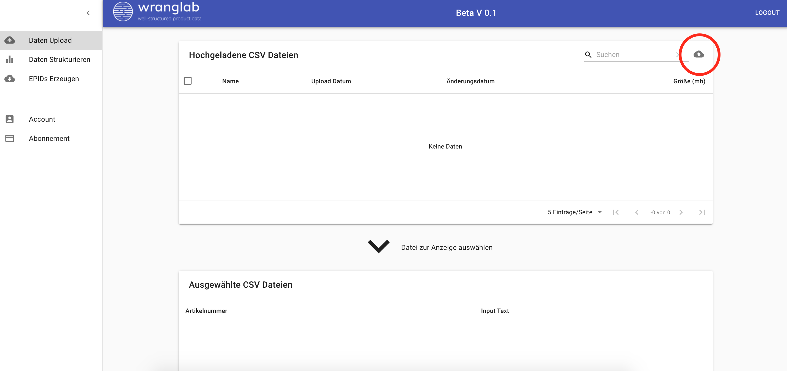
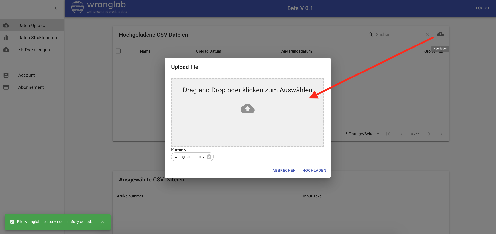
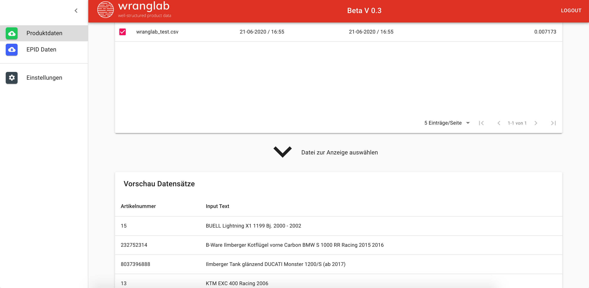

## Produkte per CSV Datei hochladen

### Format für das Hochladen der CSV Datei

**Dateiformat**: CSV  
**Seperator**: ;  
**Encoding**: UTF-8  
**Spalte A**: Eine eindeutige ID für das Rückspielen ins ERP-System.  
**Spalte B**: Produkt Information (Motorradmodel, Baujahr etc.).

**Wichtig**: Die Spaltennamen müssen exakt wie im Beispiel benannt werden.
Spalte A „articel_number; Spalte B „input_text“. Außerdem muss die Datei „Semikolon“ separiert sein.

| article_number | input_text                                |
| :------------- | :---------------------------------------- |
| 1              | APRILIA Atlantic 125 (SP) 124 Bj. 2003    |
| 2              | APRILIA Atlantic 125 (SP) 124 Bj. 03 - 05 |
| 3              | Daelim SL 125 S1 FI Otello 2011           |
| 4              | Aprilia Atlantic 500 Sprint 2004 - 2015   |
| 5              | Beta Alp 4.0 350 2004-2015                |
| 6              | BMW R 100 S 1980                          |
| 7              | BMW R 80 GS/2 Paralever 1990              |
| 8              | Honda CB 750 F2 Seven Fifty 1992-2003     |
| 9              | Honda CB 900 F Bol dOr 1979-1983          |
| 10             | Honda VT 1100 C2 Shadow ACE 1995          |
| 11             | Honda XR 500 R Pro Link 1981              |
| 12             | Kawasaki Z 750 GP Uni Trak 1983           |
| 13             | KTM EXC 400 Racing 200                    |

### Datei hochladen

## Ergebnis anzeigen

## Produkte über die eBay Schnittstelle importieren

<iframe width="1280" height="720" src="https://web.microsoftstream.com/embed/video/5b5a1e5e-c3b9-4a95-af02-8624b518d864?autoplay=false&amp;showinfo=false" allowfullscreen style="border:none; position: absolute; top: 0; left: 0; right: 0; bottom: 0; height: 100%; max-width: 100%;"></iframe>

