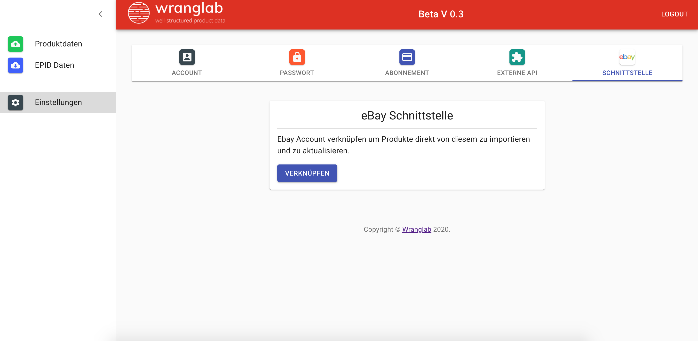
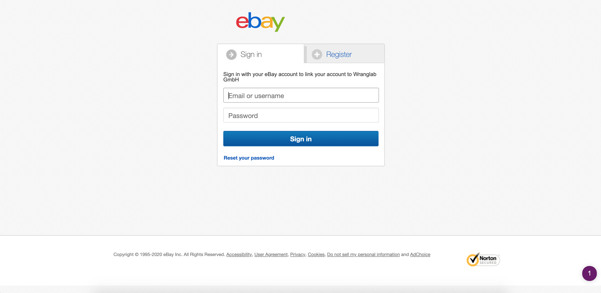
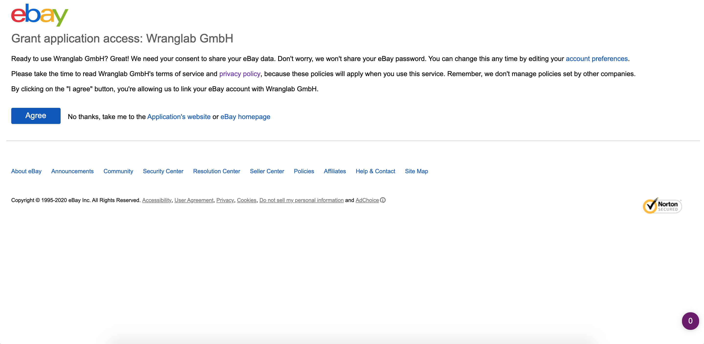
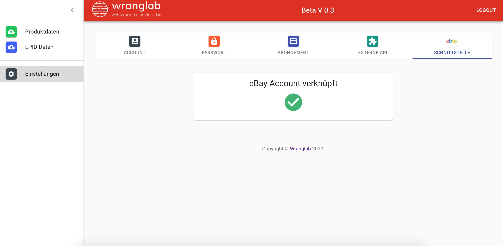

## eBay Intergration einrichten

Wranglab bietet dir die Möglichkeit, die Title deiner Produkte von eBay zu importieren.
Anhand des Titels Match unser Algorithmus die Motorradverwendungsliste. Somit hast du noch weniger Arbeit.
Dazu gehe im Menü zu *Einstellung > eBay Schnittstelle*. 

Klicke auf den Button *VERKNÜPFEN*, daraufhin wirst du zu eBay 
weitergeleitet.

Gib hier deine eBay Login Daten. 

Akzeptiere, dass wir auf deine eBay Artikeldaten zugreifen dürfen. Jetzt bist du startklar, um deine eBay Title in Wranglab
zu importieren.

