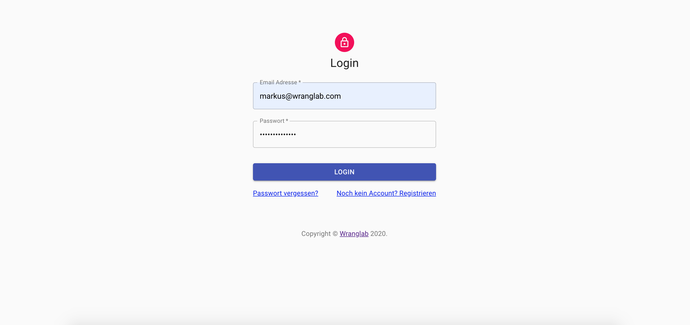
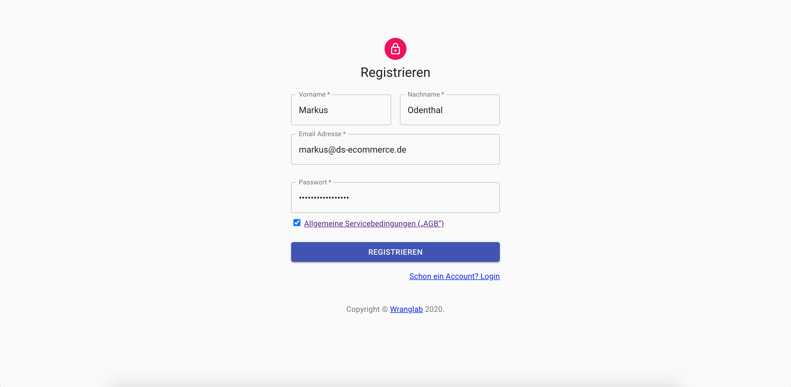
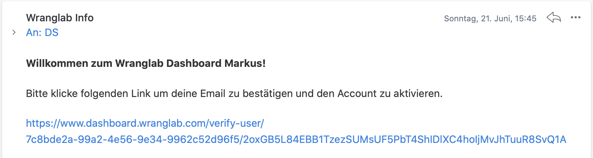
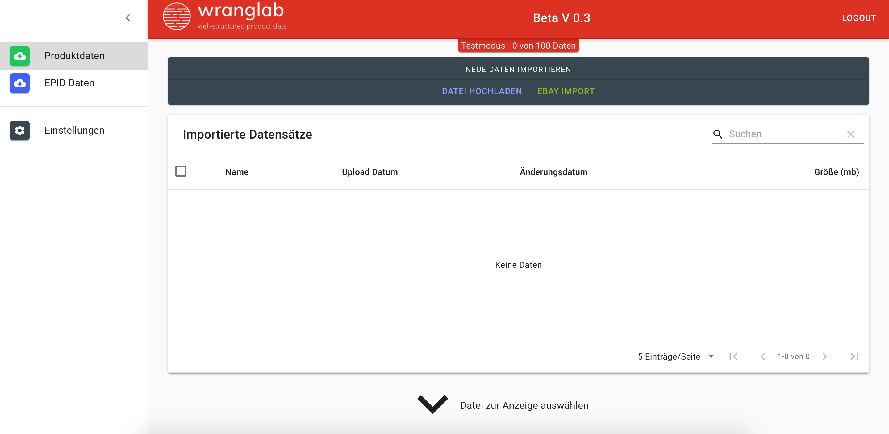
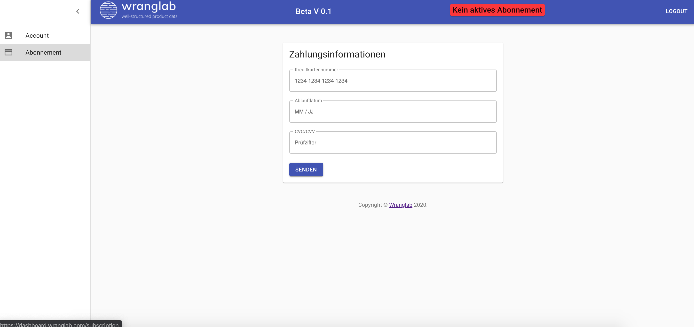
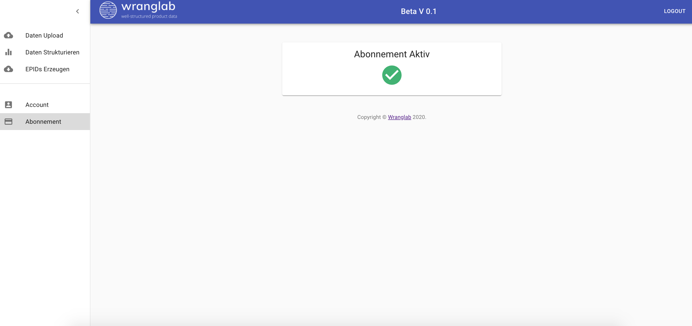

## Einloggen

Um dich in deinem Account einzuloggen benutze bitte folgenden link:
[dashboard.wranglab.com/login](https://dashboard.wranglab.com/login)

## Kundenkonto erstellen

Du hast noch keinen Account? Dann erstelle einen neuen unter dem folgenden Link erstellen:
[dashboard.wranglab.com/sign-up](https://dashboard.wranglab.com/sign-up)

**Schritt 1:** 
Erstelle einen neuen Account.

**Schritt 2:**  
Nun erhältst du eine E-Mail von uns, hier musst du deine E-Mail-Adresse bestätigen.

Jetzt hast du es geschafft und wirst auf unsere App weitergeleitet. Du erhältst direkt zum Anfang 100 Testdatensätze.
Nach erfolgreicher Überprüfung deines Accounts erhältst du den voll Zugang und kannst unbegrenzt Datenhochladen. Das 
kann bis zu 24h dauern.

<!--
## Zahlungsmethode hinzufügen

Nach erfolgreicher Übermittlung der Zahlungsinformation, kann der Account
benutzt werden. Es können für bis zu 3 Mio. Artikel Fahrzeugverwendungslisten erstellt werden.

-->