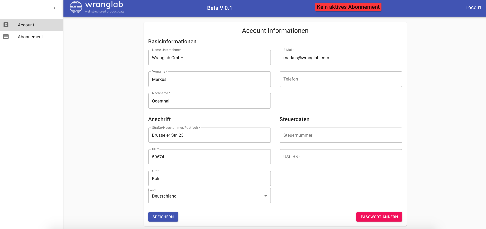

## Einloggen oder Kundenkonto erstellen

## Account information hinterlegen

## Zahlungsmethode hinzufügen

Nach erfolgreicher Übermittlung der Zahlungsinformation, kann der Account
benutzt werden. Es können für bis zu 3 Mio. Artikel Fahrzeugverwendungslisten erstellt werden.

