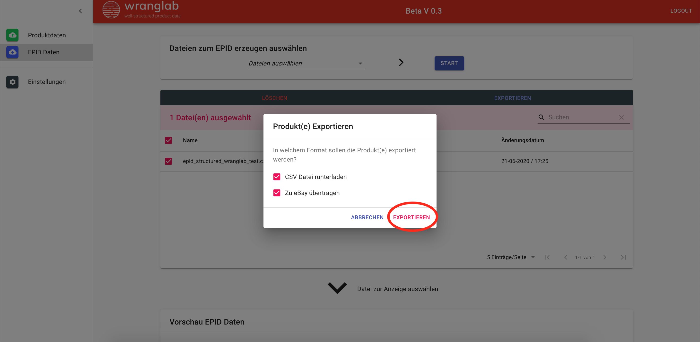

## Dateien auswählen und durch unsere KI strukturieren lassen

## Ergebnis anzeigen

## Interpretation der Ergebnisse

Eine Genauigkeit zwischen 95% - 100% reicht in der Regel, um eine korrekte Übereinstimmung zu liefern.

## Export der Ergebnisse

Im letzen Schritt wollen wir dir zeigen wie du die Ergbnisse entweder als CSV runterladen kannst oder direkt auf eBay
übertragen kannst. Dazu auf den Button *EXPORTIEREN* klicken. 

Daraufhin öffnet sich ein neues Fenster. Hier kannst du auswählen ob du das Ergebnisse per CSV oder direkt auf eBay
übertragen möchtest. 
 

In dem Beispiel übertragen wir die Listen auf eBay und zusätzlich als CSV Datei. 
