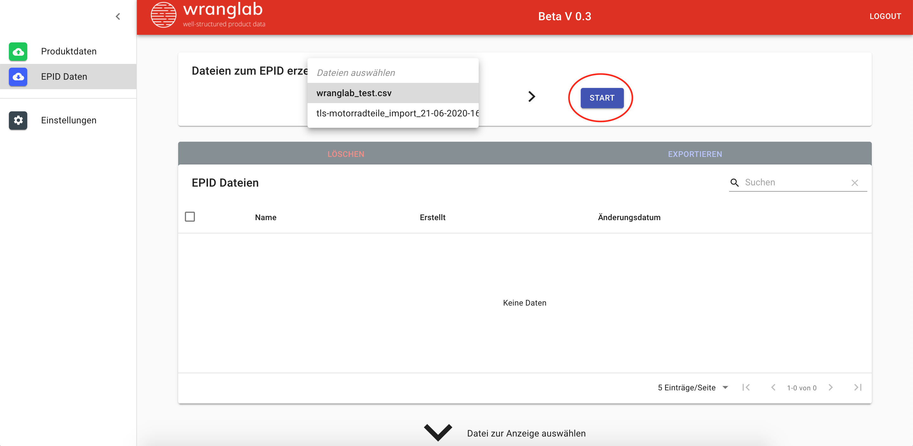
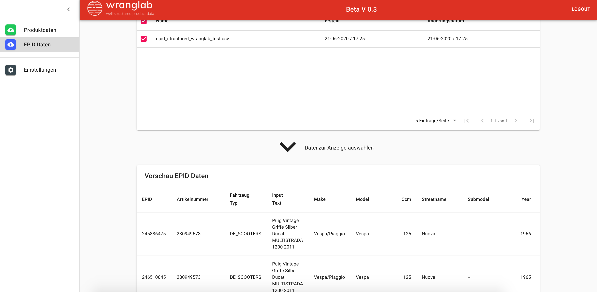

## Dateien auswählen und durch unsere KI strukturieren lassen

<iframe width="1280" height="720" src="https://web.microsoftstream.com/embed/video/681b4ea5-ea96-4c2c-850f-8c336232148f?autoplay=false&amp;showinfo=false" allowfullscreen style="border:none; position: absolute; top: 0; left: 0; right: 0; bottom: 0; height: 100%; max-width: 100%;"></iframe>

 

## Interpretation und runterladen der erzeugten EPID Daten

<iframe width="1280" height="720" src="https://web.microsoftstream.com/embed/video/9ac9aa69-049e-412f-a978-3e40bda0d0d8?autoplay=false&amp;showinfo=false" allowfullscreen style="border:none; position: absolute; top: 0; left: 0; right: 0; bottom: 0; height: 100%; max-width: 100%;"></iframe>

### Ergebnis anzeigen

### Interpretation der Ergebnisse

Eine Genauigkeit zwischen 90% - 100% reicht in der Regel, um eine korrekte Übereinstimmung zu liefern.

### Fertige Daten runterladen und in dein ERP System einpflegen

