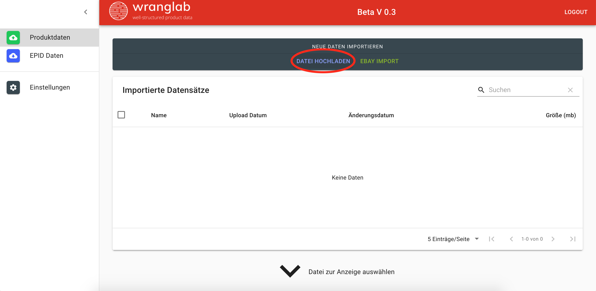
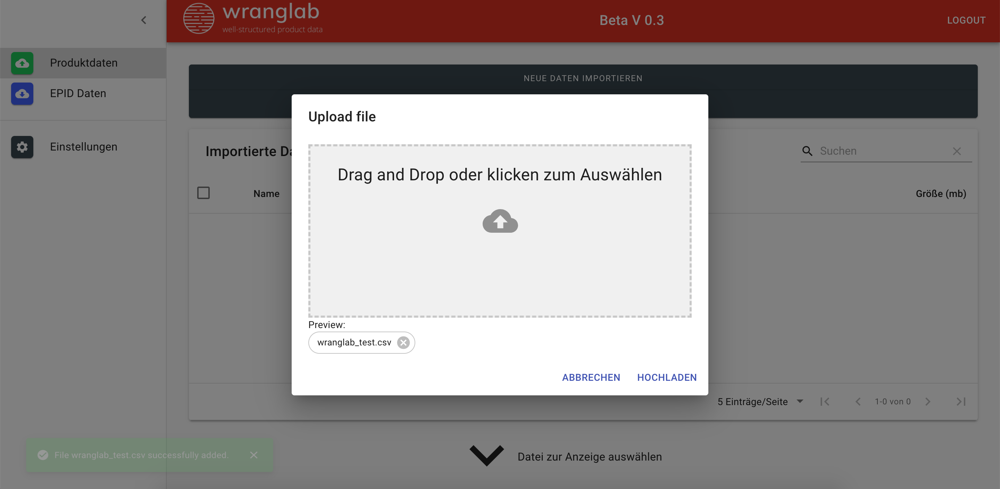
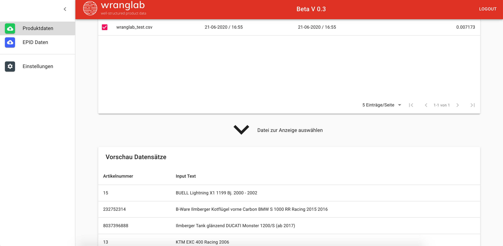
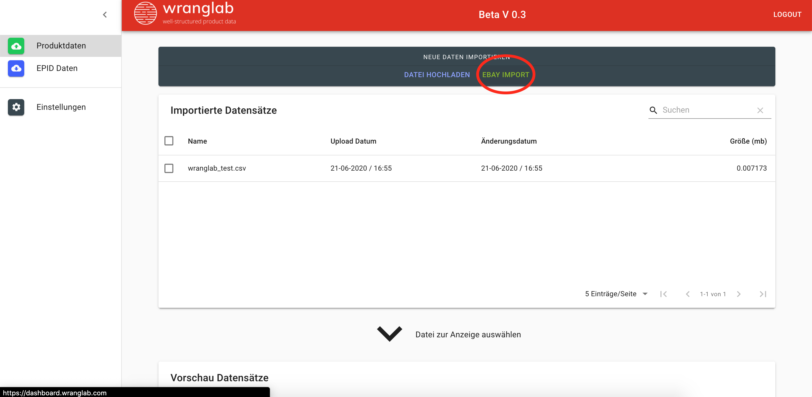
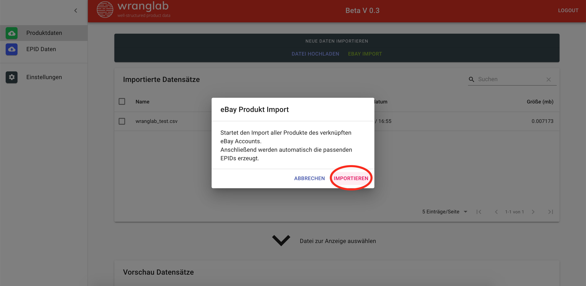
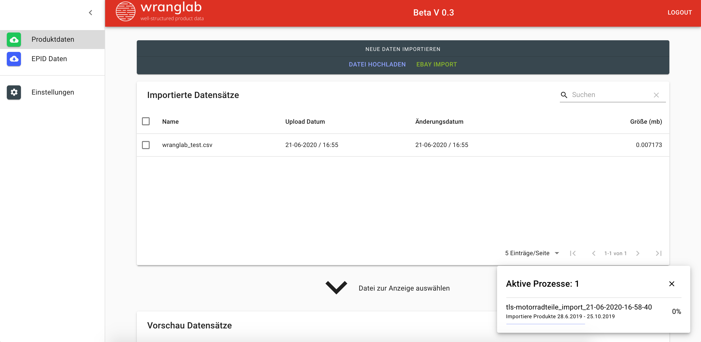
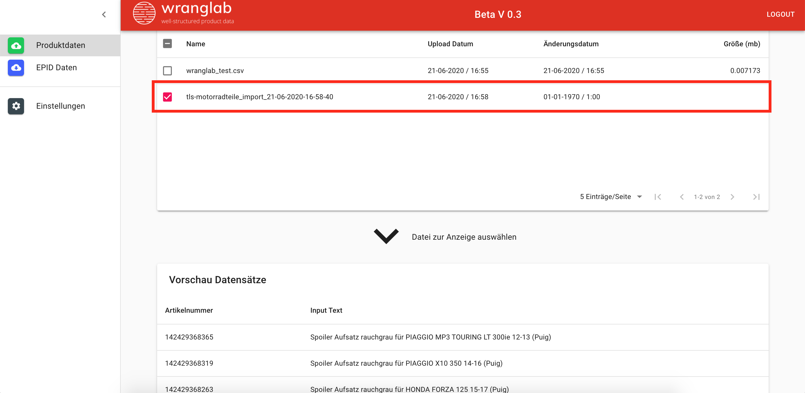

## Produkte per CSV Datei hochladen

### Datei Format

**Dateiformat**: CSV  
**Seperator**: ;  
**Encoding**: UTF-8  
**Spalte A**: Eine eindeutige ID für das Rückspielen ins ERP-System.  
**Spalte B**: Produkt Information (Motorradmodel, Baujahr etc.).

**Wichtig**: Die Spaltennamen müssen exakt wie im Beispiel benannt werden.
Spalte A „articel_number; Spalte B „input_text“. Außerdem muss die Datei „Semikolon“ separiert sein.

| article_number | input_text                                |
| :------------- | :---------------------------------------- |
| 1              | APRILIA Atlantic 125 (SP) 124 Bj. 2003    |
| 2              | APRILIA Atlantic 125 (SP) 124 Bj. 03 - 05 |
| 3              | Daelim SL 125 S1 FI Otello 2011           |
| 4              | Aprilia Atlantic 500 Sprint 2004 - 2015   |
| 5              | Beta Alp 4.0 350 2004-2015                |
| 6              | BMW R 100 S 1980                          |
| 7              | BMW R 80 GS/2 Paralever 1990              |
| 8              | Honda CB 750 F2 Seven Fifty 1992-2003     |
| 9              | Honda CB 900 F Bol dOr 1979-1983          |
| 10             | Honda VT 1100 C2 Shadow ACE 1995          |
| 11             | Honda XR 500 R Pro Link 1981              |
| 12             | Kawasaki Z 750 GP Uni Trak 1983           |
| 13             | KTM EXC 400 Racing 200                    |

### CSV Datei hochladen

### Ergebnis anzeigen

## Artikeldaten aus eBay importieren

<iframe width="1280" height="720" src="https://www.youtube.com/embed/XRucgOXPpkA" frameborder="0" allow="accelerometer; autoplay; encrypted-media; gyroscope; picture-in-picture" allowfullscreen style="border:none; position: absolute; top: 0; left: 0; right: 0; bottom: 0; height: 100%; max-width: 100%;"></iframe>

### eBay Import starten

Klicke den Button \*EBAY IMPORT\*\*

Wenn dein eBay Account bereitsverknüft ist kannst nun im nächsten Fenster den Import starten.
Dann werden alle deine eBay Artikeltitel von deinem eBay Account in Wranglab importiert.
Das kann bis zu 1h dauern.

Nach dem erfolgreichen Import werden die eBay Artikeldatei in der Übersicht angezeigt.

