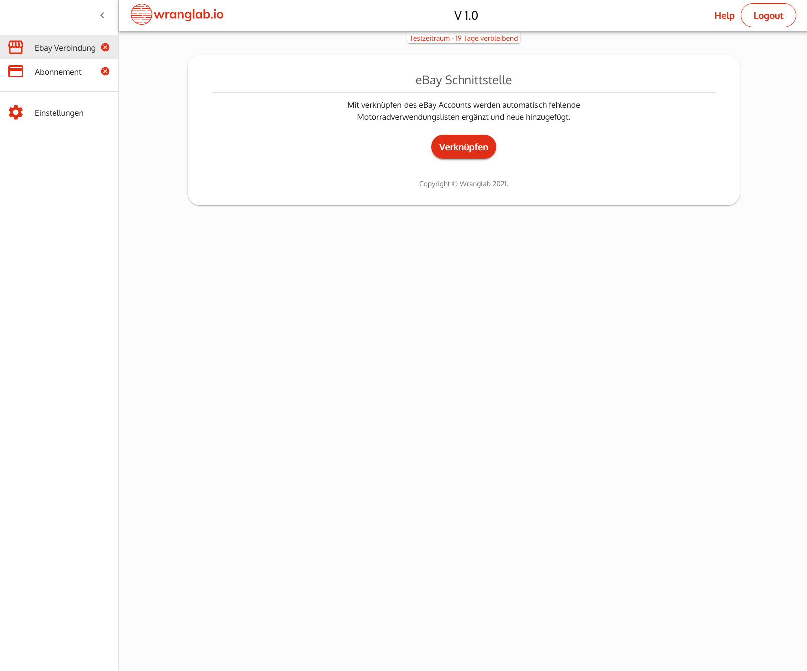
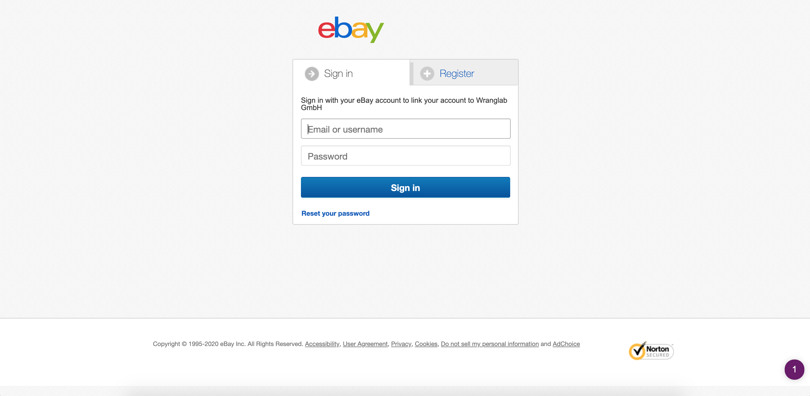
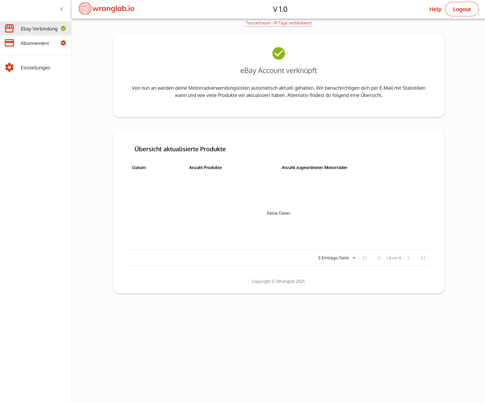

Wranglab bietet dir die Möglichkeit, vollkommen automatisch deine Motorradverwendungslisten aktuell zu halten. 
Anhand der Produkttitel, Beschreibungen und Merkmale wie Barcode oder Herstellernummer erzeugt unser Algorithmus 
die Motorradverwendungslisten. Somit hast du nach Absolvieren der folgenden Schritte noch weniger Arbeit.

## eBay verbinden
Dazu gehe im Menü zu **eBay Verbindung** und klicke auf den Button *VERKN&Uuml;PFEN*. 
Daraufhin wirst du zu eBay weitergeleitet. 

## eBay Login
Gib hier deine eBay Login Daten ein.

## Zugriff erlauben
Akzeptiere, dass wir auf deine eBay Artikeldaten zugreifen dürfen.

## Geschafft
Jetzt bist du startklar, von nun an werden deine Motorradverwendungslisten automatisch erzeugt und aktuell gehalten. 
Eine &Uuml;bersicht der aktualisierten Produkte findest unter dem Men&uuml;punkt **eBay Verbindung**.

