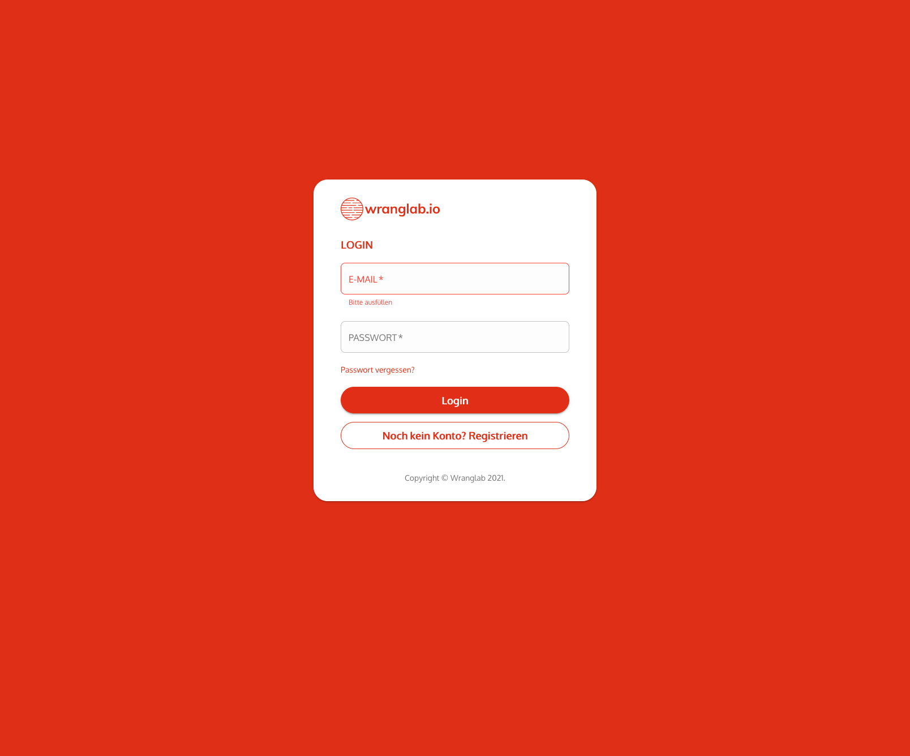

## Einloggen
Um dich in deinem Account einzuloggen benutze bitte folgenden link:
[dashboard.wranglab.com/login](https://dashboard.wranglab.com/login)

## Kundenkonto erstellen
Du hast noch keinen Account? Dann erstelle einen neuen unter dem folgenden Link:
[dashboard.wranglab.com/sign-up](https://dashboard.wranglab.com/sign-up)

### Registrieren
Erstelle einen neuen Account.

### E-Mail Adresse best&auml;tigen
Nun erhältst du eine E-Mail von uns um diese zu bestätigen.

### Geschafft
Ab hier startet deine 3-monatige kostenlose Testphase. Innerhalb dieser Zeit kannst du alle Funktionen der App ohne Einschr&auml;nkungen nutzen.
