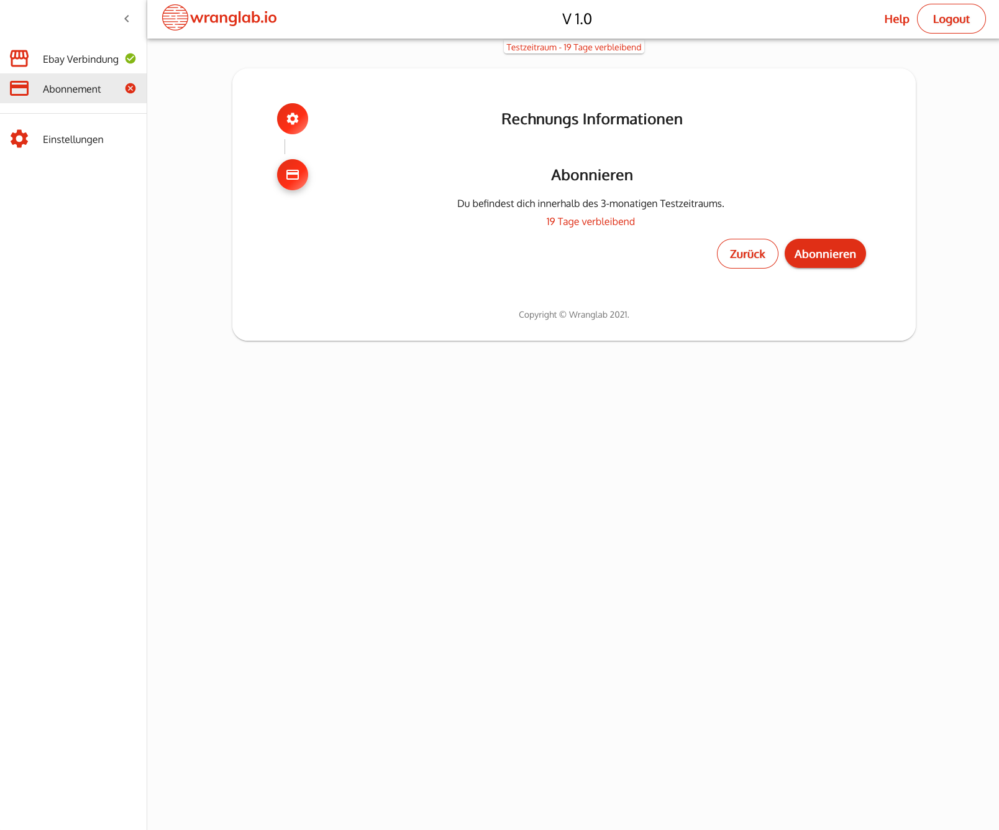

Um Wranglab.io auch nach der kostenlosen Testphase weiter nutzen zu können, ist es notwendig ein Abonnement abzuschlie&szlig;en.

## Rechnungsinformationen
Gebe hier zun&auml;chst deine Rechnungsinformationen ein. Diese kannst du nachtr&auml;glich zu jeder Zeit unter dem 
Men&uuml;punkt **Einstellungen > Account** ab&auml;ndern.

## Abonnieren
Mit klicken auf den Button *ABONNIEREN* wirst du zu unserem Zahlungsprovider weitergeleitet und wirst dort gebeten 
deine Zahlungsinformationen einzugeben.

### Zahlungsinformationen
Gebe hier deine Zahlungsinformationen ein.

## Geschafft
Nach erfolgreicher Übermittlung der Zahlungsinformationen, wirst du auf das Dashboard zurückgeleitet und kannst alle
Funktionen uneingeschr&auml;nkt nutzen.

Mit klicken auf den Button *VERWALTEN* wirst du zu unserem Zahlungsprovider weitergeleitet und kannst ggf. 
deine Zahlungsmethode anpassen.

